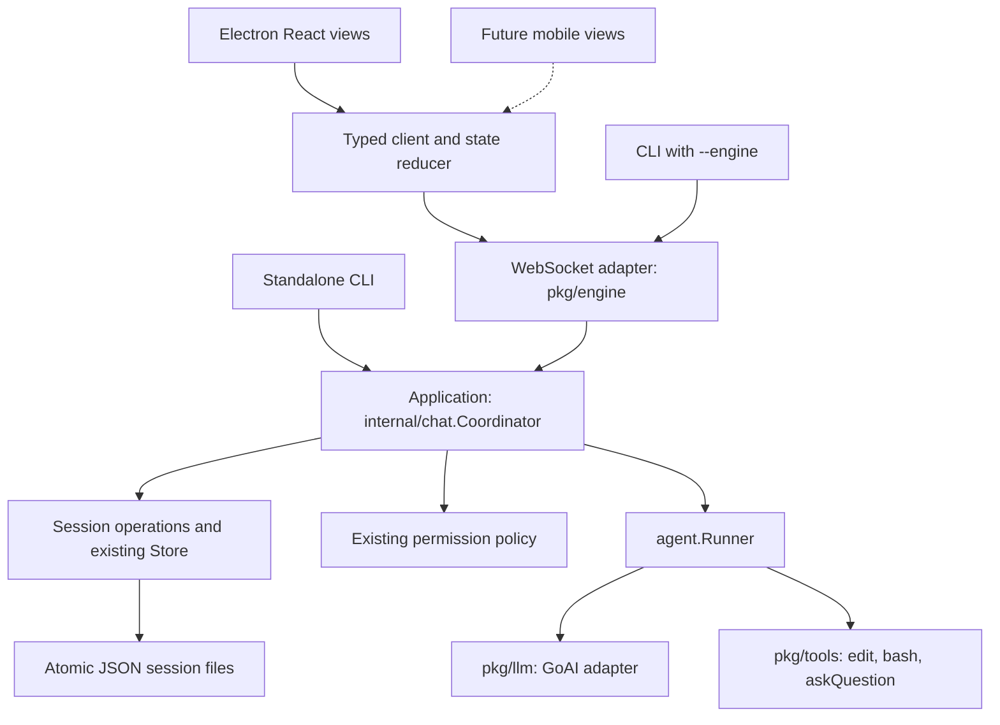

# Excelsior architecture proposal

Date: 2026-09-07  
Status: proposed; this document does not change application behavior.

## Recommendation

Keep one Go engine and make `internal/chat` the owner of run lifecycle, session coordination, and user interactions. Reduce `pkg/engine` to a WebSocket adapter. Split the desktop client into a connection module, a pure state reducer, and React views.

This is a modular monolith: independently testable responsibilities inside the existing executable. Keep Electron, React, GoAI, WebSockets, and atomic JSON session files. The improvement comes from making ownership explicit and using the same application operations across clients.

Assumptions: one trusted owner, work executes on one computer, multiple clients may control that computer, and mobile is a future client. Supporting unrelated users or automatically recovering tool execution after a process crash would require a different scope.

The current [architecture](../ARCHITECTURE.md) already establishes useful guarantees: engine-owned runs, canonical workspace scoping, atomic snapshot subscription, and disconnect-independent execution. Preserve those guarantees. The existing [improvement roadmap](improvement-roadmap.md) covers individual defects and optimization work; this proposal defines the boundaries those changes should fit within.

## What needs to change

| Current design, verified in source | Consequence | Proposed boundary |
| --- | --- | --- |
| [`runs.go`](../pkg/engine/runs.go) stores protocol envelopes and deltas in run state; [`chat_handler.go`](../pkg/engine/chat_handler.go) constructs runners and installs permission/question callbacks. | Application lifecycle depends on WebSocket connection code. | A concrete `chat.Coordinator` owns transport-neutral runs and interactions. |
| `beginTurn` loads history, then [`chat.Service`](../internal/chat/service.go) reloads it before execution and again before saving. | Snapshots and execution obtain history through different paths. | Load one record under a session reservation; execute and save that record. |
| [`agent.go`](../pkg/agent/agent.go) emits `done` before persistence; the engine later emits an outer `done`, including after failure. | Generation completion and saved success have ambiguous meanings. | One application terminal outcome, with success emitted only after the save succeeds. |
| [`runAgent`](../cmd/excelsior/main.go) creates its own `DirStore`; [`DirStore`](../pkg/session/session.go) locks only its own instance. | Separate processes can overwrite the same session even though each file replacement is atomic. | Enforce one process owning session storage for each canonical workspace. |
| [`useEngine.ts`](../apps/electron/lib/useEngine.ts) combines sockets, authentication, history mapping, interactions, and React state; [`page.tsx`](../apps/electron/app/page.tsx) also sends directly through `wsRef`. | Ordering rules and command failures are spread across the UI. | Typed client commands and one reducer; views receive state and actions. |
| [`handleSessionList`](../pkg/engine/handlers.go) combines history scans with Git queries. | Loading the sidebar also performs unrelated working-tree analysis. | Basic session metadata and optional workspace Git status are separate queries. |

## Target structure



Arrows show calls and dependencies; snapshots and events return in the opposite direction. `cmd/excelsior` constructs the coordinator, runner factory, and transport. Electron main owns desktop startup and native capabilities, outside the renderer-to-engine data path.

Suggested layout, added incrementally:

```text
cmd/excelsior/                  flags, startup, composition, CLI output
internal/app/agent.go           existing runner construction
internal/chat/
  coordinator.go               reservations, commands, subscriptions, shutdown
  service.go                   prepared-turn execution and commit
  event.go                     application events, snapshots, outcomes
internal/sessions/service.go   existing session operations
internal/permissions/policy.go existing policy resolution
internal/workspaces/           workspace identity and storage ownership
pkg/engine/                    auth, WS reader/writer, command/event mapping
pkg/protocol/                  wire DTOs and protocol version
pkg/agent/, pkg/llm/, pkg/tools/ existing execution library
pkg/session/                   existing Store and JSON implementation
apps/electron/
  main.js, preload.js          desktop lifecycle and narrow native bridge
  lib/engineClient.ts          socket, handshake, typed commands, correlation
  lib/engineState.ts           pure reducer and session projections
  lib/useEngine.ts             React lifecycle, selectors, actions
  lib/protocol.ts              wire types checked against Go fixtures
  app/, components/           views and UI-only state
```

Avoid a repository-wide package rename. Keep the existing `agent.Runner`, `session.Store`, and provider interfaces, which already have useful implementations or test doubles. The coordinator is a concrete type; it does not need an additional interface, service container, or generic event bus.

Dependency rule: `internal/chat` imports execution, storage, and policy types, never WebSocket or `pkg/protocol` types. The transport maps application types to wire types. `internal/app` remains the runner builder; command startup supplies it to the coordinator, avoiding a composition cycle between `app` and `engine`.

## Backend ownership and lifecycle

### One application entry point

Expose a small set of coordinator operations: start, cancel, snapshot-and-subscribe, reply-to-interaction, session operations, and shutdown. Method names are implementation choices; their contracts are the architecture.

Every operation receives an explicit canonical workspace and session identity. Capture the connection's selected workspace when dispatching a command. Once a run starts, its workspace and model remain fixed. Later navigation affects that connection's future commands only.

The coordinator owns each run's context, runner, current-turn projection, pending interaction, and terminal outcome. A connection owns authentication, selected workspace, subscription handles, and its bounded send queue. Closing a connection releases subscriptions without canceling a run.

`internal/chat/service.go` becomes the coordinator's prepared-turn executor. It accepts an already loaded record plus incoming messages, executes the runner, filters replay history, and saves the result. Remove its redundant history loads after all callers use the coordinator. Reuse `internal/sessions` helpers for CRUD; callers must pass through coordinator reservations for writes.

### Completion is an application decision

```text
preparing -> running <-> waiting_for_interaction
                |
                v
            persisting -> succeeded

preparing / running / waiting -> failed or canceled
persisting                   -> persistence_failed
```

The application distinguishes model finish/usage from terminal run outcome. Preserve the public agent library's event behavior if necessary; translate its `done` into generation metadata before exposing it to application clients.

For persisted sessions, the sequence is:

1. Validate the command, reserve its session, and load the record once. A missing session may be created; an unreadable or corrupted session fails without overwrite.
2. Append incoming messages once. Use the same prepared history for the initial snapshot and the runner.
3. Publish text, tool, and interaction events while executing. Keep the reservation while waiting for a user reply.
4. On successful generation, enter `persisting` and save replay-safe history. Rename, delete, and another start remain blocked for this session.
5. Publish one terminal outcome and make the session available as one ordered state transition. No new run's snapshot may overtake the previous terminal event.

Once commit begins, let it finish and report its actual result; a late cancellation must not turn an already committed success into a canceled run. Cancellation before commit never claims saved success. Ephemeral CLI runs may succeed with `persisted:false`; persisted success requires `persisted:true`.

Return the generated result alongside a save error so the current client can still display or export it. Preserve the latest terminal projection in memory within an explicit retention budget. Snapshots expose whether an unsaved projection is available. Eviction or process restart can remove unsaved output; do not imply durable recovery.

Canceled or failed tools can leave filesystem changes. An unsuccessful conversation save is not a rollback of those changes. Keep incomplete tool conversations out of the next model request.

### Preserve ordering before changing locks

First extract the coordinator with the current ordering mechanism intact. Then, if contention measurements justify it, separate a short registry lock from session-local coordination.

A session reservation must cover loading, execution, persistence, and metadata mutations. Different sessions can proceed independently. Disk I/O, provider calls, tools, and socket writes must not run under the registry lock after the lock split.

Snapshot-and-subscribe remains one operation: register a subscription and enqueue an immutable snapshot before any later events for that session. The coordinator orders bounded event delivery; the adapter only serializes and forwards it. A full subscriber queue closes that subscription/connection and requires a new snapshot. Never silently discard an interaction or terminal event.

Do not unlock around existing code without preserving these invariants. Snapshot slices must not alias mutable live event storage. Reclaim session entries only when there is no active run, command, or subscription using them.

### Storage has one process owner

Keep `.excelsior/sessions/<id>.jsonl` and its current format. Atomic replacement protects individual file writes; a separate ownership rule protects read-modify-write sequences.

Acquire an OS-held exclusive lease for the canonical workspace's session store before opening it for persistent operations. Retain it until that runtime closes the store after draining work. Every daemon and standalone persistent CLI path must use this acquisition path. A second writer gets an actionable error directing it to the existing engine through `--engine`.

This preserves standalone `--session` use when no engine owns that workspace. A plain lock-file existence check is insufficient because crashes leave stale files; implement and test a lock released by the OS on process exit for each supported platform. Until this lands, retain the current documented single-process restriction and make no stronger claim.

Session isolation does not isolate working-tree changes. Different sessions still share files, and external editors or shells can change them. Preserve current concurrent-session behavior, but document this ceiling. If independent parallel edits become a product requirement, add explicit per-task worktrees then; a storage mutex cannot provide that isolation.

### Approvals and shutdown

Move the existing policy resolution and tool interaction callbacks into the coordinator. Pending interactions use application types, keyed by workspace, session, run, interaction ID, and kind. Validate and consume the first matching reply atomically. Publish its resolution to all subscribers; reject stale or duplicate replies.

Application startup must install explicit permission handling. Keep CLI behavior that denies an unanswered approval in headless mode. An authenticated owner's shell commands execute with engine process privileges; a shell working directory is not a filesystem sandbox.

Shutdown stops new starts, cancels active contexts, waits for bounded cleanup without holding coordinator locks, then closes subscriptions and storage leases. Bound subprocess cancellation as described in the roadmap. If cleanup exceeds the budget, report incomplete shutdown and terminate the owning process; never release ownership while a lingering worker can still save.

For remote CLI, make Ctrl+C send `chat.cancel` with the acknowledged run ID before disconnecting, and report when cancellation cannot be confirmed. A broken connection alone continues to mean detach. This corrects the current client path in [`client.go`](../pkg/engine/client.go), which closes the socket when its context ends.

## Client state and protocol

### Split connection mechanics from application state

`engineClient.ts` owns WebSocket construction, authentication, reconnect backoff, typed command sending, and request ID correlation. It emits decoded protocol messages and connection transitions. It exposes no raw socket to components.

`engineState.ts` owns a pure reducer for server snapshots, active runs, transcript projections, usage, and pending interactions. Scope server state to engine endpoint, canonical workspace, and session ID. Track the current run ID and a local connection generation so late callbacks from a replaced connection cannot update the new one.

`useEngine.ts` binds the client and reducer to React. `page.tsx` keeps drafts, dialogs, selected navigation, and other UI preferences. Components call actions such as `startChat`, `cancelRun`, and `replyToInteraction`; remove direct socket writes and public transcript/streaming setters.

Store pending interactions as server-described data. Clicking an answer sends a command, and the server's resolution clears the prompt. A reconnect must not depend on a Promise created by the old socket.

### Make synchronization explicit

```text
disconnected -> connecting -> authenticating -> synchronizing -> ready
```

During synchronization, acknowledge the desired workspace, restore the active session and tracked background subscriptions, then apply their snapshots. Only expose session commands as ready after the required state has been restored. A rejected workspace selection leaves the previous confirmed scope intact and reports the error.

Replace each session projection from its snapshot, then apply subsequent ordered events. Validate workspace, run, and interaction identities. Keep an explicit desired-subscription set so reconnect restores background runs as well as the visible conversation. Discard callbacks from an older connection generation.

Use the existing envelope ID for command acknowledgements and errors. For a new conversation, acknowledge `session.create` before submitting its prompt, giving the client a stable session to inspect even if the subsequent start acknowledgement is lost. `startChat` receives an acknowledgement containing the session and server-selected run IDs. Remove timestamp-generated session IDs from the view layer.

Distinguish a command that was never sent from one whose acknowledgement was lost. Retain the draft after a local send failure. For an uncertain result, reconnect and inspect the authoritative snapshot; do not automatically resend a prompt, approval, or other mutation. Safe automatic retry would require a separate server deduplication contract.

The current ordered WebSocket stream plus atomic snapshots is enough for recovery from client disconnection. A durable event log and replay cursor are unnecessary for this scope.

### Evolve the contract deliberately

First refactor behind the current v1 protocol. Then add typed start acknowledgements and terminal outcomes, with snapshots carrying the same outcome information. For example, a terminal payload needs `sessionId`, `runId`, `status`, `persisted`, and an optional structured error code. Distinguish `session_busy`, `stale_interaction`, and `persistence_failed` without clients parsing error strings.

Advertise these semantics through an authentication capability response. Update Electron and the Go remote client together, and require the capability before enabling commands that depend on it. Keep legacy mapping isolated in the transport during the transition. If an existing message's meaning must change incompatibly, introduce an explicit new protocol version instead of silently reusing v1.

[`protocol.ts`](../apps/electron/lib/protocol.ts) already lacks snapshot fields present in Go, including running state and pending interactions. Treat Go wire DTOs as the current contract, update TypeScript to match, and check both with serialized fixtures plus runtime decoding of incoming messages. Begin with focused contract cases; add generation only if maintaining the shapes becomes repetitive.

When a mobile client is actually started, extract the framework-independent client and reducer into a shared package. Inject token storage and connection creation through small functions. React hooks, browser storage, and Electron APIs stay in their platform adapters.

## Persistence, queries, and resource limits

Keep JSON sessions authoritative. Basic `session.list` returns metadata without loading histories again to infer Git changes. Query working-tree status separately and label its totals as workspace changes, since they cannot establish which session caused an edit. Use repository-relative paths when associating files.

The existing `DirStore.List` still parses session files. Measure list latency and bytes read at representative history sizes; add a rebuildable metadata cache only if that scan matters. Move to SQLite only when indexed queries, transactional records, or measured storage costs justify a migration. Introducing accounts to support one owner's phone adds no value here.

Define byte limits at the boundaries that own them: command/frame validation in transport, current-run projections and subscriber queues in the coordinator, actual provider input in the agent/LLM adapter, and file/output/process limits in tools. Display truncation alone does not limit subsequent model input. Retention limits must preserve a coherent snapshot or explicitly report unavailable unsaved content.

Batch adjacent text updates in the React adapter if profiling shows rendering pressure, while promptly applying interactions and flushing text before terminal events. Use existing structured logging for command IDs, run outcomes, storage failures, queue overflow, and shutdown timing. Record measurements before claiming performance gains.

## Desktop lifecycle

Keep Electron main responsible for discovering or spawning the local engine, reporting readiness/failure, opening native dialogs, and providing credentials only through its existing narrow preload bridge. The renderer owns conversation presentation. Resolve one endpoint descriptor for both the spawned listener and client connection; the current `ENGINE_ADDR` and `ENGINE_URL` settings can otherwise diverge.

Package the engine for the installation's OS and architecture as part of the build. In packaged mode, resolve it from packaged resources and use an explicit writable workspace. Validate the full authenticated handshake; `/health` alone does not establish that a compatible engine is ready.

Track whether Electron spawned the process. Quitting closes an owned engine using the bounded shutdown path and leaves an externally managed engine running. Mobile availability requires an independently running engine, as the current architecture already documents. Keep owner-token authentication and an encrypted private connection for remote access. Preserve renderer sandboxing and context isolation, and validate native IPC callers and navigation against exact trusted renderer origins or paths.

## Migration and acceptance

Each stage should remain buildable and preserve existing session files.

| Stage | Change | Evidence required before proceeding |
| --- | --- | --- |
| 1. Extract ownership | Move run state, interaction routing, and cancellation into `internal/chat`; keep v1 behavior. | Existing disconnect survival, cross-client approval, workspace scoping, corruption, and slow-subscriber tests pass. |
| 2. Unify execution | Load once, reserve through save, expose application outcomes, update both clients' protocol handling. | Inject save failure after generation: no saved-success state; one terminal outcome; the next run cannot overtake completion. |
| 3. Separate desktop state | Add typed client and reducer; remove direct `wsRef` sends and duplicated state mutation. | Replay workspace rejection, engine switching with identical session IDs, reconnect during approval, background subscriptions, and unsent/uncertain commands. |
| 4. Enforce process ownership | Add workspace store leases and explicit CLI cancellation. | Two processes cannot write one workspace store; process exit releases ownership; Ctrl+C cancels an acknowledged remote run. |
| 5. Finish operational work | Package engine per target, bound shutdown and tools, separate Git queries. | Clean installed-app smoke tests on supported OSes; cancellation leaves no test subprocess running; external engine survives desktop exit. |
| 6. Optimize measured costs | Split locks, cache metadata, or batch rendering only where measurements justify them. | Blocking fake storage in session A cannot stall session B's cancellation; snapshots remain ordered; record before/after list and stream measurements. |

Extend the existing tests in [`pkg/engine`](../pkg/engine/personal_test.go) and [`internal/chat`](../internal/chat/service_test.go); move application invariants into coordinator tests and retain smaller WebSocket integration tests. Use deterministic fakes for storage failures and paused runners. Test the actual ownership boundary, not private helper layout.

Implementation checks: `go test ./...`, `go vet ./...`, `go build ./...`, race tests on supported runners, desktop TypeScript checking, reducer/contract tests, and installed-app smoke tests. These are proposed acceptance checks, not results from this documentation change.

After implementation, update `ARCHITECTURE.md` to describe the delivered behavior. Reconcile [`MOBILE_PLAN.md`](../MOBILE_PLAN.md), [`FLOWS.md`](../FLOWS.md), and [`docs/flows.md`](flows.md): they contain older SQLite/account, token-in-URL, TUI, or transport descriptions that do not match the current source. The mobile plan should consume the owner-token engine protocol and snapshots.

## Deliberate limits

Runs survive client disconnects, but unsaved progress does not survive engine restart. Durable interrupted-run display can later use a separate bounded checkpoint with explicit incomplete status; it must never automatically re-execute tools. That feature is a persistence contract change, separate from this extraction.

Multiple sessions share a working tree. One owner token grants control of the engine computer. Session JSON remains a single-process store with an enforced ownership lease. These limits fit the current personal-agent product; revisit them when the product requirements change.

The first useful deliverable is stages 1 and 2: a coordinator that can be tested without a socket and a terminal outcome that accurately states whether history was saved. That gives desktop, CLI, and future mobile clients a consistent application contract without replacing the existing execution stack.
