# Excelsior Flows

Sequence diagrams for every flow in the app. Mermaid-rendered on GitHub.

Participants:
- **UI** — Electron/Next.js frontend (`apps/electron`)
- **Engine** — Go WebSocket hub (`pkg/engine`)
- **Agent** — agent loop (`pkg/agent`) + LLM (`pkg/llm`)
- **Store** — session store (memory / sqlite / dir)

---

## 1. Connection & bootstrap

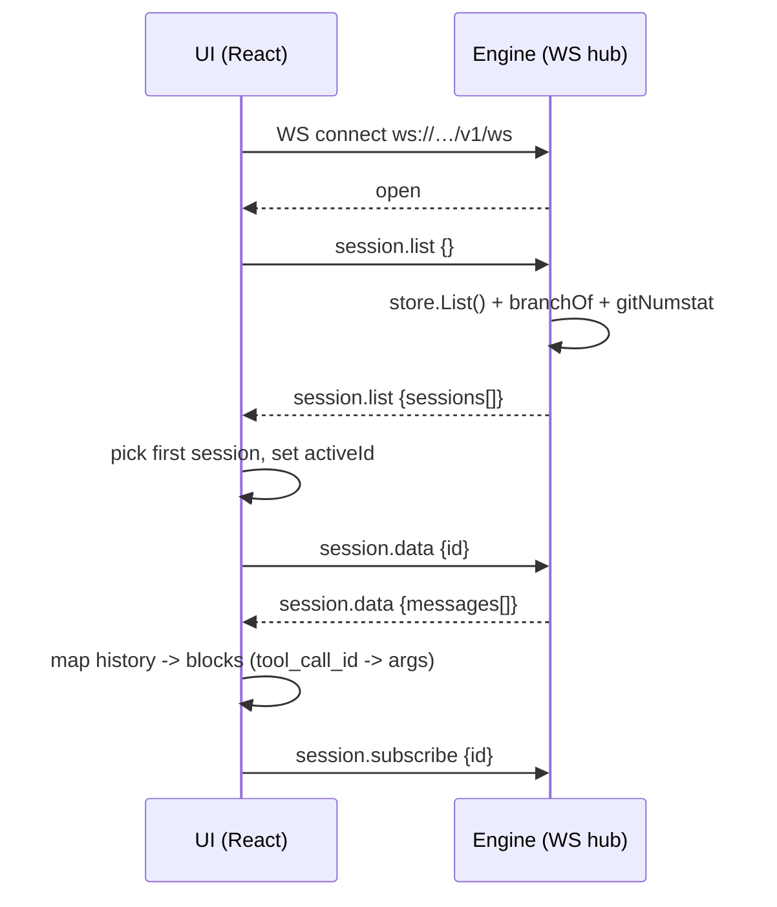

## 2. Chat turn (happy path)

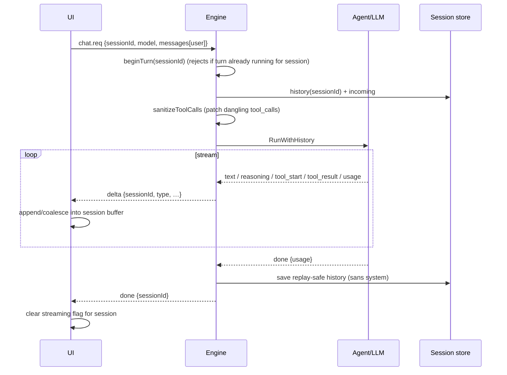

## 3. Tool call (bash / edit)

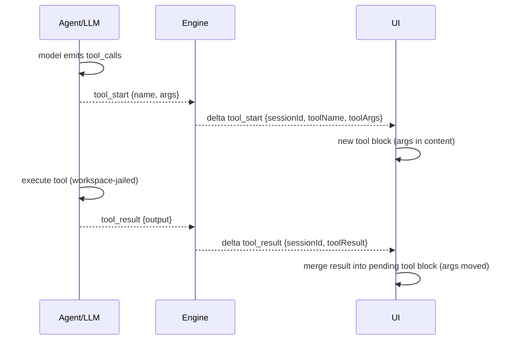

## 4. Permission request (mutating op)

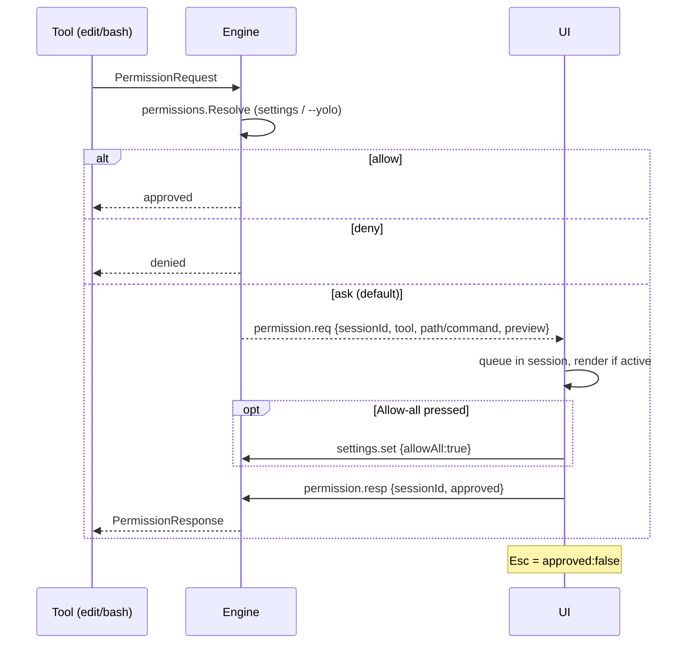

## 5. Ask question (askQuestion tool)

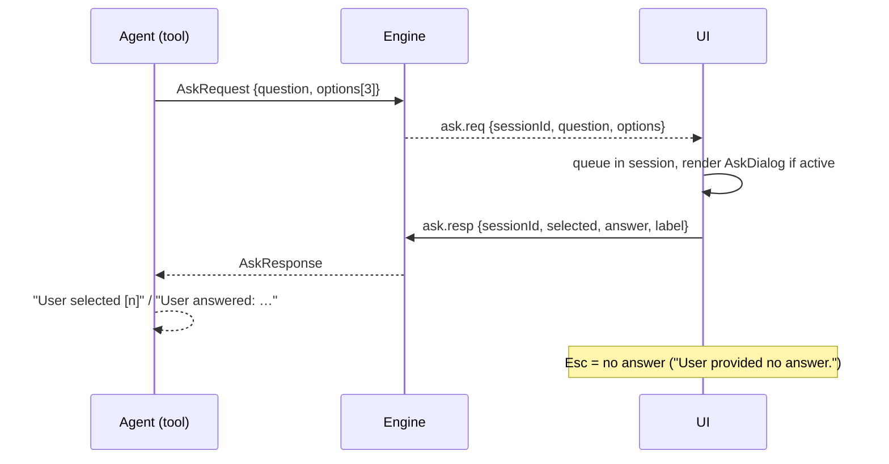

## 6. Parallel sessions

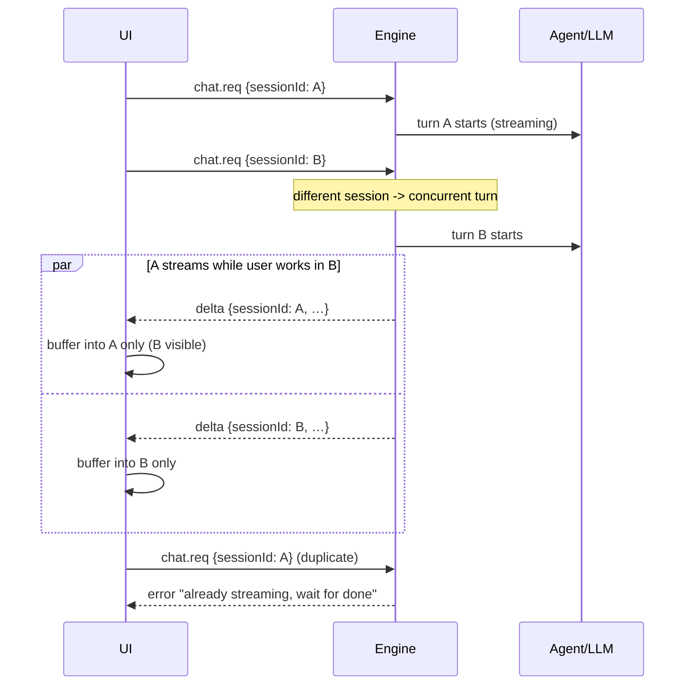

## 7. Session switch / load history

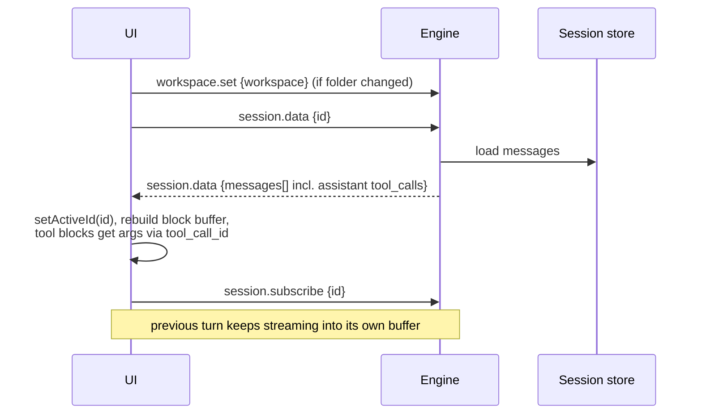

## 8. Session create

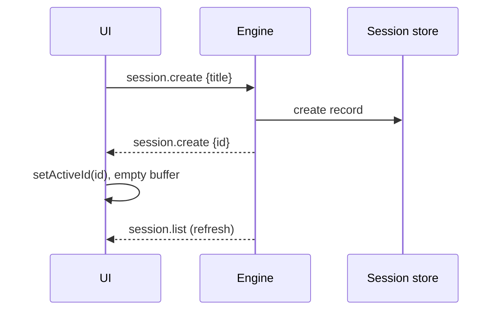

## 9. Session delete / rename

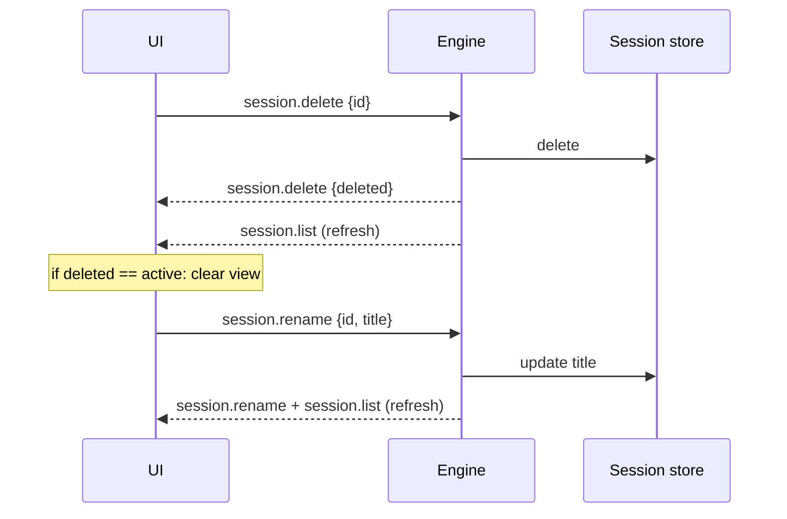

## 10. Settings

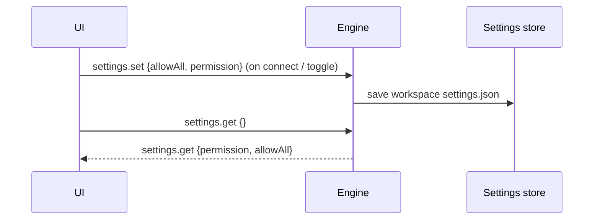

## 11. Open folder (desktop only)

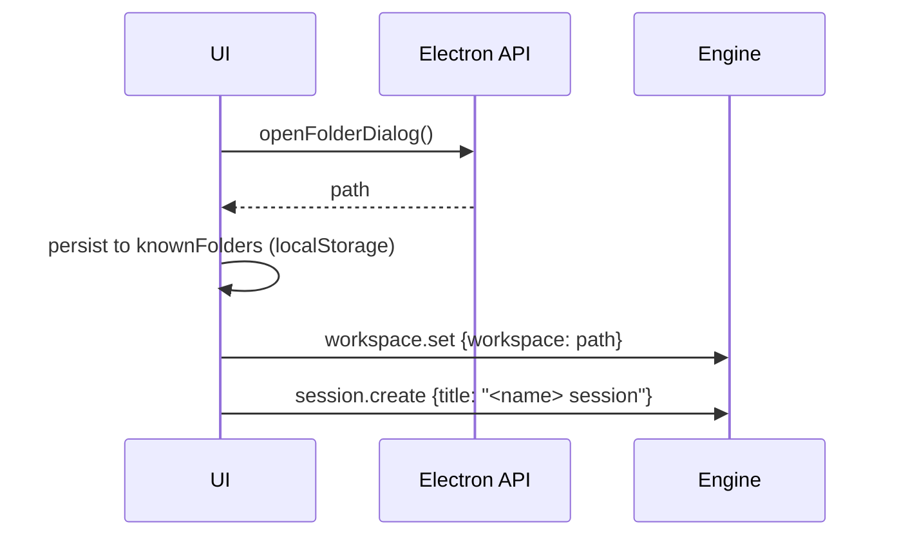

## 12. Headless CLI run

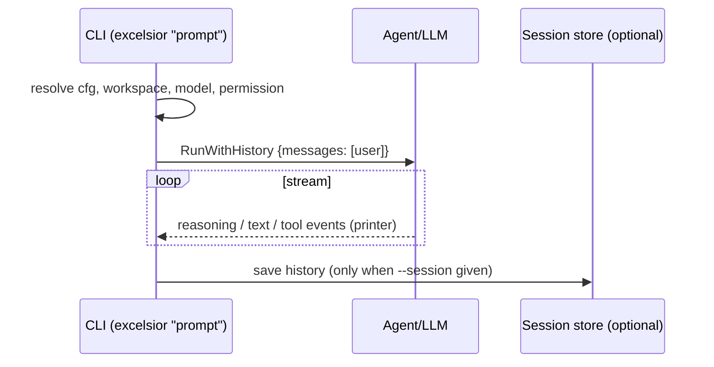

## 13. Engine daemon

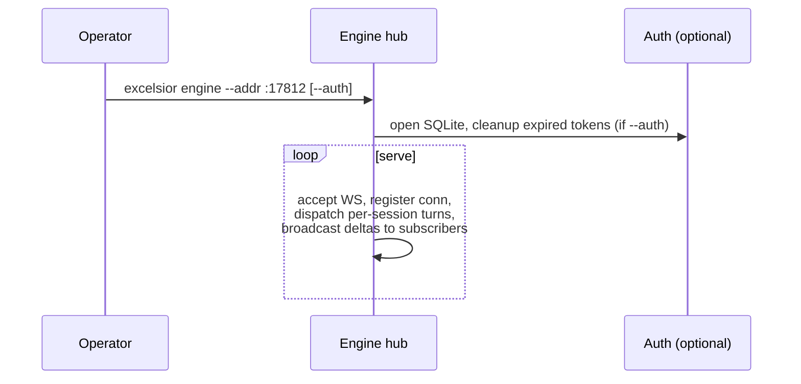

## 14. Agent loop internals (Go)

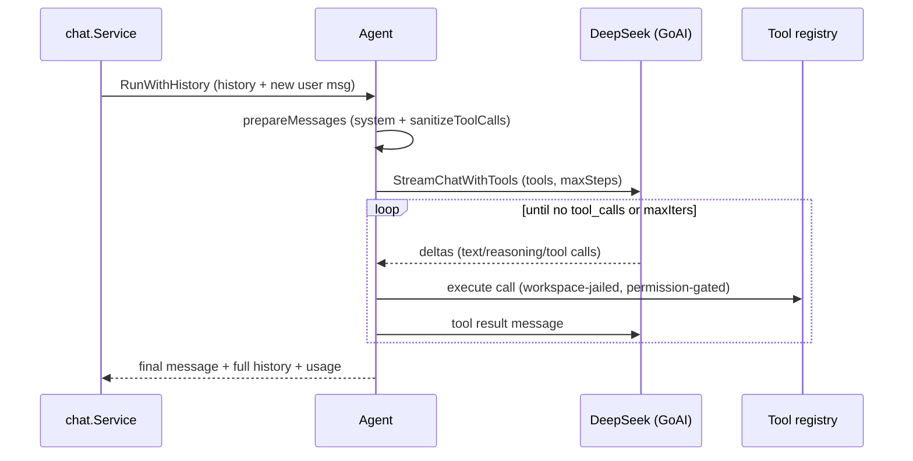
