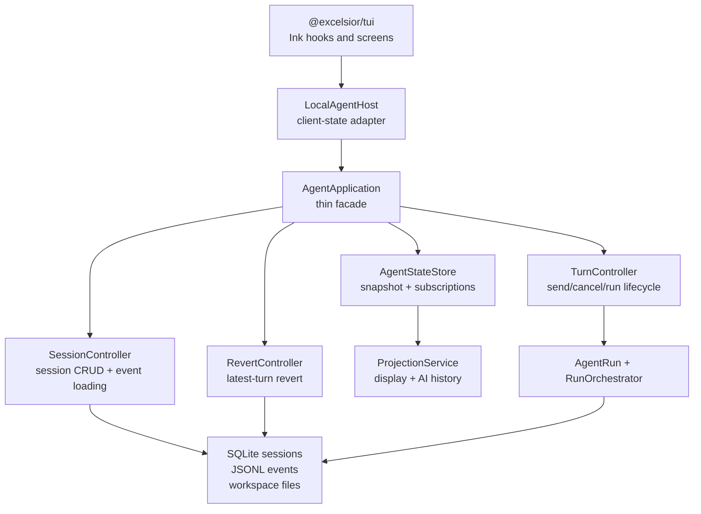
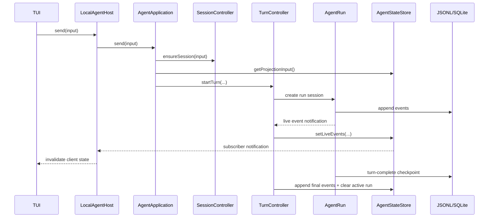
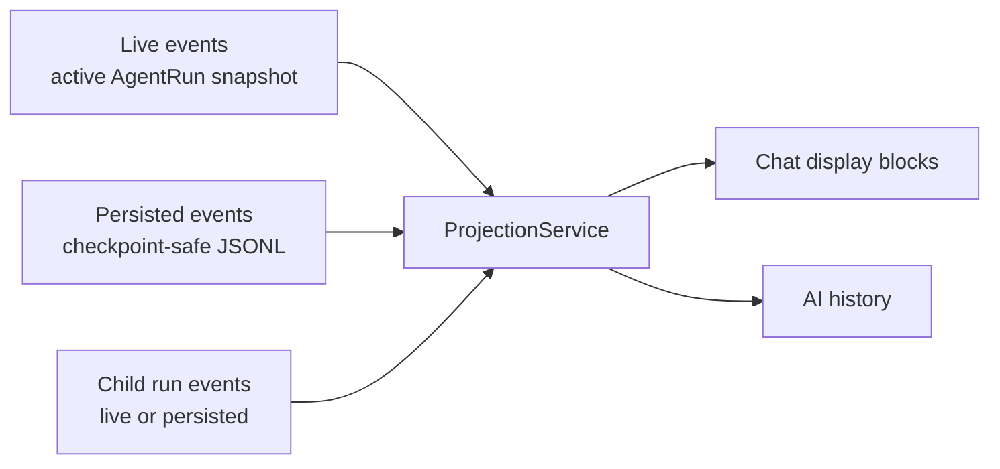
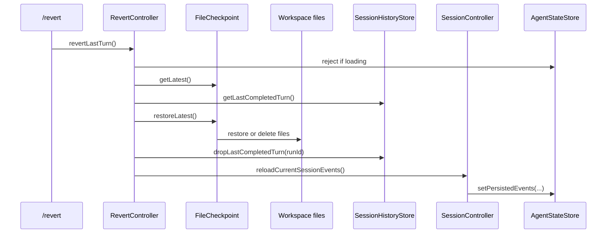

# Runtime State Architecture

Excelsior keeps UI state, live runtime state, and persisted replay state separate.
The important rule is:

```text
AgentRun = live in-progress truth
JSONL = durable completed-turn truth
ProjectionService = turns events into UI and AI history
AgentStateStore = owns the current app snapshot
LocalAgentHost = adapts that snapshot to the TUI
```

## Application Shape



## Turn Flow



## Event Sources



`ProjectionService` centralizes the policy: while a run is active, live parent
events are used for current output; otherwise checkpoint-safe persisted events
are used for replay.

## Tool Safety

`ToolContext` is per-run operational state. It carries the workspace root,
current Plan/Act mode, confirmation bus, abort signal, and optional revert
checkpoint capability.

```text
ToolContext
  capabilities
  confirm
  abortSignal
  workspaceRoot
  mode
  revert.fileCheckpoint
```

Sub-agents receive a child `ToolContext`, so workspace bounds, cancellation,
confirmations, and revert checkpointing stay consistent.

## Revert Flow

`/revert` only reverts the latest completed turn and only file changes made by
the built-in `write` and `edit` tools.



If any checkpointed file changed after the agent turn, revert reports a
conflict and does not trim history.
